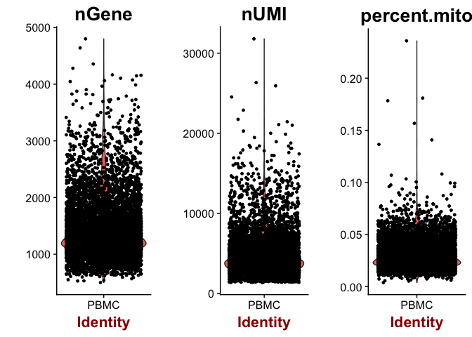

scRNA-Seq Tutorial Part 1: Data QC and Processing
================

# Dependencies

``` r
library(Seurat)
```

    ## Loading required package: ggplot2

    ## Loading required package: cowplot

    ## 
    ## Attaching package: 'cowplot'

    ## The following object is masked from 'package:ggplot2':
    ## 
    ##     ggsave

    ## Loading required package: Matrix

``` r
library(dplyr)
```

    ## 
    ## Attaching package: 'dplyr'

    ## The following objects are masked from 'package:stats':
    ## 
    ##     filter, lag

    ## The following objects are masked from 'package:base':
    ## 
    ##     intersect, setdiff, setequal, union

``` r
library(viridis)
```

    ## Loading required package: viridisLite

# Load the data

``` r
pbmc.data <- Read10X(data.dir = "../data/filtered_gene_bc_matrices/hg19/")
head(rownames(pbmc.data))
```

    ## [1] "MIR1302-10"   "FAM138A"      "OR4F5"        "RP11-34P13.7"
    ## [5] "RP11-34P13.8" "AL627309.1"

``` r
head(colnames(pbmc.data))
```

    ## [1] "AAACATACAACCAC" "AAACATTGAGCTAC" "AAACATTGATCAGC" "AAACCGTGCTTCCG"
    ## [5] "AAACCGTGTATGCG" "AAACGCACTGGTAC"

``` r
pbmc <- CreateSeuratObject(raw.data = pbmc.data, min.cells = 3, project = "PBMC")
```

The min.cells option will remove genes whose expression is detected in
\<3 cells. This just helps clean up the data set.

# The importance of QC, filtering, and appropriate normalization

It’s tempting to jump right into the analysis and look at our
data.

``` r
pbmc <- NormalizeData(object = pbmc, normalization.method = "LogNormalize")
pbmc <- ScaleData(pbmc)
```

    ## [1] "Scaling data matrix"
    ## 
      |                                                                       
      |                                                                 |   0%
      |                                                                       
      |=================================================================| 100%

``` r
pbmc <- RunPCA(pbmc, pc.genes=rownames(pbmc.data))
```

    ## [1] "PC1"
    ##  [1] "CST3"     "TYROBP"   "FCER1G"   "LST1"     "FTL"      "AIF1"    
    ##  [7] "FTH1"     "FCN1"     "TYMP"     "LYZ"      "LGALS1"   "S100A9"  
    ## [13] "CFD"      "CD68"     "SERPINA1" "CTSS"     "SPI1"     "IFITM3"  
    ## [19] "S100A8"   "SAT1"     "LGALS2"   "PSAP"     "IFI30"    "S100A11" 
    ## [25] "CFP"      "COTL1"    "NPC2"     "GRN"      "LGALS3"   "GSTP1"   
    ## [1] ""
    ##  [1] "MALAT1"  "RPS27A"  "RPS27"   "RPL23A"  "RPL3"    "RPL13A"  "RPS3A"  
    ##  [8] "RPL21"   "RPL9"    "LTB"     "RPS6"    "RPS3"    "RPSA"    "CD3D"   
    ## [15] "PTPRCAP" "RPS25"   "RPL31"   "RPS18"   "RPS12"   "RPL30"   "RPS15A" 
    ## [22] "RPL13"   "IL32"    "RPLP2"   "RPL27A"  "RPS23"   "RPS29"   "CD3E"   
    ## [29] "LDHB"    "RPS13"  
    ## [1] ""
    ## [1] ""
    ## [1] "PC2"
    ##  [1] "NKG7"    "PRF1"    "CST7"    "B2M"     "GZMA"    "GZMB"    "FGFBP2" 
    ##  [8] "CTSW"    "HLA-C"   "GNLY"    "HLA-A"   "GZMH"    "FCGR3A"  "CD247"  
    ## [15] "SPON2"   "CCL5"    "GZMM"    "CCL4"    "KLRD1"   "AKR1C3"  "MYL12A" 
    ## [22] "CLIC3"   "XCL2"    "RARRES3" "IL32"    "HOPX"    "IFITM1"  "CTSC"   
    ## [29] "CFL1"    "PFN1"   
    ## [1] ""
    ##  [1] "RPL32"     "HLA-DRA"   "CD79A"     "RPL18A"    "TCL1A"    
    ##  [6] "S100A8"    "MS4A1"     "RPL13"     "LINC00926" "RPL11"    
    ## [11] "RPS9"      "S100A9"    "HLA-DQB1"  "LGALS2"    "VPREB3"   
    ## [16] "HLA-DRB1"  "HLA-DQA1"  "HLA-DMA"   "LY86"      "RPL12"    
    ## [21] "NCF1"      "RPL28"     "FCER2"     "RPLP1"     "CD74"     
    ## [26] "HLA-DPB1"  "RPL13A"    "CD79B"     "RPL8"      "FTL"      
    ## [1] ""
    ## [1] ""
    ## [1] "PC3"
    ##  [1] "RPS2"   "RPL10"  "RPL18A" "EEF1A1" "RPS12"  "RPL11"  "RPL32" 
    ##  [8] "RPL28"  "RPL12"  "RPL19"  "RPS5"   "RPS18"  "RPS10"  "RPS14" 
    ## [15] "RPS16"  "RPS19"  "RPS6"   "RPL8"   "RPL13"  "RPL5"   "GNB2L1"
    ## [22] "RPLP2"  "RPS23"  "RPLP1"  "RPL29"  "RPLP0"  "RPL10A" "RPS13" 
    ## [29] "RPL14"  "RPL18" 
    ## [1] ""
    ##  [1] "GZMB"       "NKG7"       "CST7"       "FGFBP2"     "PRF1"      
    ##  [6] "CCL5"       "GZMA"       "GNLY"       "CCL4"       "SPON2"     
    ## [11] "PPBP"       "PF4"        "CTSW"       "SDPR"       "GZMH"      
    ## [16] "GNG11"      "SPARC"      "HIST1H2AC"  "CLIC3"      "GP9"       
    ## [21] "KLRD1"      "S1PR5"      "PRSS23"     "AP001189.4" "CD9"       
    ## [26] "ITGA2B"     "XCL2"       "CLU"        "NRGN"       "TUBB1"     
    ## [1] ""
    ## [1] ""
    ## [1] "PC4"
    ##  [1] "CD3D"      "S100A4"    "S100A6"    "TMSB4X"    "IL32"     
    ##  [6] "CD3E"      "LDHB"      "IL7R"      "VIM"       "GIMAP7"   
    ## [11] "NOSIP"     "ANXA1"     "S100A10"   "S100A8"    "ZFP36L2"  
    ## [16] "FYB"       "GIMAP4"    "RPS14"     "CD2"       "S100A9"   
    ## [21] "FOS"       "S100A11"   "RGCC"      "HCST"      "RGS10"    
    ## [26] "LCK"       "GIMAP1"    "LEF1"      "PRKCQ-AS1" "TRAT1"    
    ## [1] ""
    ##  [1] "CD79A"     "HLA-DQA1"  "CD79B"     "MS4A1"     "HLA-DQB1" 
    ##  [6] "TCL1A"     "CD74"      "HLA-DPB1"  "LINC00926" "HLA-DRA"  
    ## [11] "VPREB3"    "HLA-DPA1"  "HLA-DQA2"  "HLA-DRB1"  "HLA-DRB5" 
    ## [16] "BANK1"     "FCER2"     "TSPAN13"   "HLA-DMA"   "HVCN1"    
    ## [21] "FCRLA"     "HLA-DMB"   "HLA-DOB"   "PDLIM1"    "PKIG"     
    ## [26] "SPIB"      "CD72"      "EAF2"      "CD37"      "KIAA0125" 
    ## [1] ""
    ## [1] ""
    ## [1] "PC5"
    ##  [1] "NKG7"   "FGFBP2" "CST7"   "GZMB"   "PRF1"   "GNLY"   "GZMA"  
    ##  [8] "CCL4"   "SPON2"  "GZMH"   "CTSW"   "RPL10"  "KLRD1"  "CYBA"  
    ## [15] "RPS2"   "CLIC3"  "XCL2"   "PRSS23" "IGFBP7" "TTC38"  "AKR1C3"
    ## [22] "S1PR5"  "HOPX"   "GZMM"   "RPL6"   "CCL3"   "TMSB10" "TYROBP"
    ## [29] "GPR56"  "MATK"  
    ## [1] ""
    ##  [1] "SDPR"       "PF4"        "PPBP"       "GNG11"      "SPARC"     
    ##  [6] "HIST1H2AC"  "GP9"        "TUBB1"      "RGS18"      "NRGN"      
    ## [11] "CLU"        "AP001189.4" "ITGA2B"     "PTCRA"      "CA2"       
    ## [16] "CD9"        "TMEM40"     "MMD"        "ACRBP"      "NGFRAP1"   
    ## [21] "TREML1"     "MPP1"       "F13A1"      "RUFY1"      "CMTM5"     
    ## [26] "TSC22D1"    "PTGS1"      "SEPT5"      "PGRMC1"     "LY6G6F"    
    ## [1] ""
    ## [1] ""

``` r
PCAPlot(pbmc)
```

<!-- -->

But let’s look into what might contribute to the shape of this PCA
plot

``` r
FeaturePlot(pbmc, features.plot=c("nUMI", "nGene"), reduction.use="pca", cols.use=viridis(100), 
            max.cutoff="q95")
```

<!-- -->

PC2 directly correlates with the number of UMIs measured from each cell,
giving an artificial appearance of a trajectory/phenotypic
continuum.

# Quality control

``` r
mito.genes <- grep(pattern = "^MT-", x = rownames(x = pbmc@data), value = TRUE)
percent.mito <- Matrix::colSums(pbmc@raw.data[mito.genes, ])/Matrix::colSums(pbmc@raw.data)

# AddMetaData adds columns to object@meta.data, and is a great place to
# stash QC stats
pbmc <- AddMetaData(object = pbmc, metadata = percent.mito, col.name = "percent.mito")
VlnPlot(object = pbmc, features.plot = c("nGene", "nUMI", "percent.mito"), nCol = 3)
```

<!-- -->

``` r
# GenePlot is typically used to visualize gene-gene relationships, but can
# be used for anything calculated by the object, i.e. columns in
# object@meta.data, PC scores etc.  Since there is a rare subset of cells
# with an outlier level of high mitochondrial percentage and also low UMI
# content, we filter these as well
par(mfrow = c(1, 2))
GenePlot(object = pbmc, gene1 = "nUMI", gene2 = "percent.mito")
GenePlot(object = pbmc, gene1 = "nUMI", gene2 = "nGene")
```

<!-- -->

# Filtering

``` r
# We filter out cells that have unique gene counts over 2,500 or less than
# 200 Note that low.thresholds and high.thresholds are used to define a
# 'gate'.  -Inf and Inf should be used if you don't want a lower or upper
# threshold.
pbmc <- FilterCells(object = pbmc, subset.names = c("nGene", "percent.mito"), 
    low.thresholds = c(200, -Inf), high.thresholds = c(2500, 0.05))
```

# Normalization

``` r
pbmc <- NormalizeData(object = pbmc, normalization.method = "LogNormalize", 
    scale.factor = 10000)
```

# Identifying genes with variable expression across cells

``` r
pbmc <- FindVariableGenes(object = pbmc, mean.function = ExpMean, dispersion.function = LogVMR, 
    x.low.cutoff = 0.0125, x.high.cutoff = 5, y.cutoff = 0.5)
```

<!-- -->

``` r
length(x = pbmc@var.genes)
```

    ## [1] 1858

# Regressing out technical variables

``` r
pbmc <- ScaleData(object = pbmc, vars.to.regress = c("nUMI", "percent.mito"))
```

    ## [1] "Regressing out nUMI"         "Regressing out percent.mito"
    ## 
      |                                                                       
      |                                                                 |   0%
      |                                                                       
      |                                                                 |   1%
      |                                                                       
      |=                                                                |   1%
      |                                                                       
      |=                                                                |   2%
      |                                                                       
      |==                                                               |   3%
      |                                                                       
      |==                                                               |   4%
      |                                                                       
      |===                                                              |   4%
      |                                                                       
      |===                                                              |   5%
      |                                                                       
      |====                                                             |   6%
      |                                                                       
      |====                                                             |   7%
      |                                                                       
      |=====                                                            |   7%
      |                                                                       
      |=====                                                            |   8%
      |                                                                       
      |======                                                           |   9%
      |                                                                       
      |=======                                                          |  10%
      |                                                                       
      |=======                                                          |  11%
      |                                                                       
      |========                                                         |  12%
      |                                                                       
      |========                                                         |  13%
      |                                                                       
      |=========                                                        |  14%
      |                                                                       
      |==========                                                       |  15%
      |                                                                       
      |==========                                                       |  16%
      |                                                                       
      |===========                                                      |  17%
      |                                                                       
      |============                                                     |  18%
      |                                                                       
      |============                                                     |  19%
      |                                                                       
      |=============                                                    |  20%
      |                                                                       
      |==============                                                   |  21%
      |                                                                       
      |==============                                                   |  22%
      |                                                                       
      |===============                                                  |  22%
      |                                                                       
      |===============                                                  |  23%
      |                                                                       
      |================                                                 |  24%
      |                                                                       
      |================                                                 |  25%
      |                                                                       
      |=================                                                |  26%
      |                                                                       
      |=================                                                |  27%
      |                                                                       
      |==================                                               |  28%
      |                                                                       
      |===================                                              |  29%
      |                                                                       
      |===================                                              |  30%
      |                                                                       
      |====================                                             |  30%
      |                                                                       
      |====================                                             |  31%
      |                                                                       
      |=====================                                            |  32%
      |                                                                       
      |=====================                                            |  33%
      |                                                                       
      |======================                                           |  33%
      |                                                                       
      |======================                                           |  34%
      |                                                                       
      |=======================                                          |  35%
      |                                                                       
      |=======================                                          |  36%
      |                                                                       
      |========================                                         |  36%
      |                                                                       
      |========================                                         |  37%
      |                                                                       
      |========================                                         |  38%
      |                                                                       
      |=========================                                        |  38%
      |                                                                       
      |=========================                                        |  39%
      |                                                                       
      |==========================                                       |  40%
      |                                                                       
      |==========================                                       |  41%
      |                                                                       
      |===========================                                      |  41%
      |                                                                       
      |===========================                                      |  42%
      |                                                                       
      |============================                                     |  43%
      |                                                                       
      |=============================                                    |  44%
      |                                                                       
      |=============================                                    |  45%
      |                                                                       
      |==============================                                   |  46%
      |                                                                       
      |===============================                                  |  47%
      |                                                                       
      |===============================                                  |  48%
      |                                                                       
      |================================                                 |  49%
      |                                                                       
      |================================                                 |  50%
      |                                                                       
      |=================================                                |  51%
      |                                                                       
      |==================================                               |  52%
      |                                                                       
      |==================================                               |  53%
      |                                                                       
      |===================================                              |  54%
      |                                                                       
      |====================================                             |  55%
      |                                                                       
      |====================================                             |  56%
      |                                                                       
      |=====================================                            |  57%
      |                                                                       
      |======================================                           |  58%
      |                                                                       
      |======================================                           |  59%
      |                                                                       
      |=======================================                          |  59%
      |                                                                       
      |=======================================                          |  60%
      |                                                                       
      |========================================                         |  61%
      |                                                                       
      |========================================                         |  62%
      |                                                                       
      |=========================================                        |  62%
      |                                                                       
      |=========================================                        |  63%
      |                                                                       
      |=========================================                        |  64%
      |                                                                       
      |==========================================                       |  64%
      |                                                                       
      |==========================================                       |  65%
      |                                                                       
      |===========================================                      |  66%
      |                                                                       
      |===========================================                      |  67%
      |                                                                       
      |============================================                     |  67%
      |                                                                       
      |============================================                     |  68%
      |                                                                       
      |=============================================                    |  69%
      |                                                                       
      |=============================================                    |  70%
      |                                                                       
      |==============================================                   |  70%
      |                                                                       
      |==============================================                   |  71%
      |                                                                       
      |===============================================                  |  72%
      |                                                                       
      |================================================                 |  73%
      |                                                                       
      |================================================                 |  74%
      |                                                                       
      |=================================================                |  75%
      |                                                                       
      |=================================================                |  76%
      |                                                                       
      |==================================================               |  77%
      |                                                                       
      |==================================================               |  78%
      |                                                                       
      |===================================================              |  78%
      |                                                                       
      |===================================================              |  79%
      |                                                                       
      |====================================================             |  80%
      |                                                                       
      |=====================================================            |  81%
      |                                                                       
      |=====================================================            |  82%
      |                                                                       
      |======================================================           |  83%
      |                                                                       
      |=======================================================          |  84%
      |                                                                       
      |=======================================================          |  85%
      |                                                                       
      |========================================================         |  86%
      |                                                                       
      |=========================================================        |  87%
      |                                                                       
      |=========================================================        |  88%
      |                                                                       
      |==========================================================       |  89%
      |                                                                       
      |==========================================================       |  90%
      |                                                                       
      |===========================================================      |  91%
      |                                                                       
      |============================================================     |  92%
      |                                                                       
      |============================================================     |  93%
      |                                                                       
      |=============================================================    |  93%
      |                                                                       
      |=============================================================    |  94%
      |                                                                       
      |==============================================================   |  95%
      |                                                                       
      |==============================================================   |  96%
      |                                                                       
      |===============================================================  |  96%
      |                                                                       
      |===============================================================  |  97%
      |                                                                       
      |================================================================ |  98%
      |                                                                       
      |================================================================ |  99%
      |                                                                       
      |=================================================================|  99%
      |                                                                       
      |=================================================================| 100%
    ## Time Elapsed:  47.4836921691895 secs
    ## [1] "Scaling data matrix"
    ## 
      |                                                                       
      |                                                                 |   0%
      |                                                                       
      |=================================================================| 100%

# Cell Cycle Assignment

At this point, out data may be fine, but cell cycle can be a source of
variation in the data the confounds the biological variation of
interest. It can be good to perform an assignment and just keep track of
how it contributes to structure in downstream analysis. If it seems to
mask structure of interest, we can remove the effect of cell cycle from
the data.

Cell cycle genes are quite conserved across cell types and species. We
can use a public gene list from the Regev lab (Tirosh et al, 2015;
accessed from the Seurat website) to define cell cycle genes. I’ve
included the file in this github repo, so we don’t have to worry about
going and downloading it.

``` r
cc.genes <- readLines(con = "../data/regev_lab_cell_cycle_genes.txt")
#Split these genes into S markers and G2M markers
s.genes <- cc.genes[1:43]
g2m.genes <- cc.genes[44:97]
```

``` r
pbmc <- CellCycleScoring(object = pbmc, s.genes = s.genes, g2m.genes = g2m.genes, set.ident = TRUE)
```

S and G2M scores, as well as the phase classification have now been
added to <pbmc@meta.data>

``` r
head(pbmc@meta.data)
```

    ##                nGene nUMI orig.ident percent.mito      S.Score
    ## AAACATACAACCAC   781 2421       PBMC  0.030177759  0.093645459
    ## AAACATTGAGCTAC  1352 4903       PBMC  0.037935958 -0.024949477
    ## AAACATTGATCAGC  1131 3149       PBMC  0.008897363 -0.008387319
    ## AAACCGTGCTTCCG   960 2639       PBMC  0.017430845  0.033592976
    ## AAACCGTGTATGCG   522  981       PBMC  0.012244898 -0.032763093
    ## AAACGCACTGGTAC   782 2164       PBMC  0.016643551 -0.040598328
    ##                   G2M.Score Phase old.ident
    ## AAACATACAACCAC -0.039663192     S      PBMC
    ## AAACATTGAGCTAC -0.049169581    G1      PBMC
    ## AAACATTGATCAGC  0.061964023   G2M      PBMC
    ## AAACCGTGCTTCCG  0.004171847     S      PBMC
    ## AAACCGTGTATGCG  0.054265696   G2M      PBMC
    ## AAACGCACTGGTAC -0.081420628    G1      PBMC

# Check out the data

``` r
pbmc <- RunPCA(object = pbmc, pc.genes = pbmc@var.genes, do.print = TRUE, pcs.print = 1:5, 
    genes.print = 5)
```

    ## [1] "PC1"
    ## [1] "CST3"   "S100A9" "TYROBP" "FTL"    "LYZ"   
    ## [1] ""
    ## [1] "RPS27A"  "RPS3A"   "PTPRCAP" "RPL21"   "LTB"    
    ## [1] ""
    ## [1] ""
    ## [1] "PC2"
    ## [1] "CD79A"    "RPL18A"   "MS4A1"    "HLA-DQA1" "HLA-DQB1"
    ## [1] ""
    ## [1] "NKG7" "GZMB" "CST7" "PRF1" "GZMA"
    ## [1] ""
    ## [1] ""
    ## [1] "PC3"
    ## [1] "RPL18A" "RPL13"  "S100A4" "RPL8"   "RPL21" 
    ## [1] ""
    ## [1] "PF4"   "PPBP"  "SDPR"  "SPARC" "GNG11"
    ## [1] ""
    ## [1] ""
    ## [1] "PC4"
    ## [1] "CD79A"    "HLA-DQA1" "CD79B"    "CD74"     "MS4A1"   
    ## [1] ""
    ## [1] "IL32" "JUNB" "FYB"  "AQP3" "MAL" 
    ## [1] ""
    ## [1] ""
    ## [1] "PC5"
    ## [1] "FCGR3A"        "CTD-2006K23.1" "IFITM3"        "ABI3"         
    ## [5] "CEBPB"        
    ## [1] ""
    ## [1] "FCER1A" "LGALS2" "MS4A6A" "S100A8" "FOLR3" 
    ## [1] ""
    ## [1] ""

``` r
PCAPlot(object = pbmc)
```

<!-- -->

Perfect, there doesn’t appear to be any meaningful structure in the
first two principal components that correlates with cell cycle stage,
suggesting we don’t have to regress it out as well.

And to confirm that our normalization worked, we should double check
that the PCs aren’t correlated with nUMI any
more

``` r
FeaturePlot(pbmc, features.plot=c("nUMI", "nGene"), reduction.use="pca", cols.use=viridis(100), 
            max.cutoff="q95")
```

<!-- -->

# Save point

``` r
saveRDS(pbmc, file="../data/pbmc_processed.rds")
```
