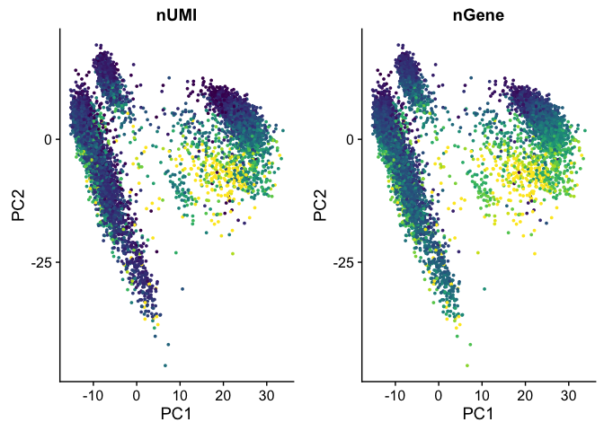
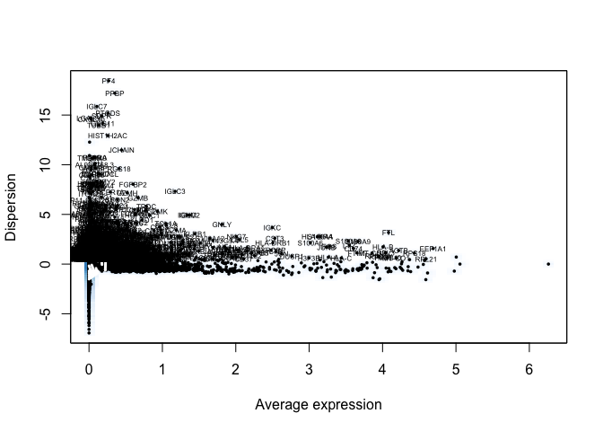
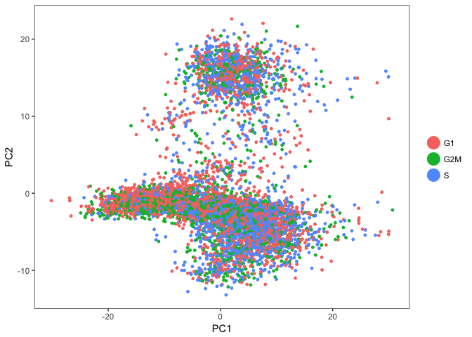

scRNA-Seq Tutorial Part 1: Data QC and Processing
================

# Dependencies

``` r
library(Seurat)
```

    ## Loading required package: ggplot2

    ## Loading required package: cowplot

    ## 
    ## Attaching package: 'cowplot'

    ## The following object is masked from 'package:ggplot2':
    ## 
    ##     ggsave

    ## Loading required package: Matrix

``` r
library(dplyr)
```

    ## 
    ## Attaching package: 'dplyr'

    ## The following objects are masked from 'package:stats':
    ## 
    ##     filter, lag

    ## The following objects are masked from 'package:base':
    ## 
    ##     intersect, setdiff, setequal, union

``` r
library(viridis)
```

    ## Loading required package: viridisLite

# Load the data

``` r
pbmc.data <- Read10X(data.dir = "../data/filtered_gene_bc_matrices_8kpbmc/GRCh38/")
head(rownames(pbmc.data))
```

    ## [1] "RP11-34P13.3"  "FAM138A"       "OR4F5"         "RP11-34P13.7" 
    ## [5] "RP11-34P13.8"  "RP11-34P13.14"

``` r
head(colnames(pbmc.data))
```

    ## [1] "AAACCTGAGCATCATC" "AAACCTGAGCTAACTC" "AAACCTGAGCTAGTGG"
    ## [4] "AAACCTGCACATTAGC" "AAACCTGCACTGTTAG" "AAACCTGCATAGTAAG"

``` r
pbmc <- CreateSeuratObject(raw.data = pbmc.data, min.cells = 3, project = "PBMC")
```

The min.cells option will remove genes whose expression is detected in
\<3 cells. This just helps clean up the data set.

# The importance of QC, filtering, and appropriate normalization

It’s tempting to jump right into the analysis and look at our
data.

``` r
pbmc <- NormalizeData(object = pbmc, normalization.method = "LogNormalize")
pbmc <- ScaleData(pbmc)
```

    ## [1] "Scaling data matrix"
    ## 
      |                                                                       
      |                                                                 |   0%
      |                                                                       
      |===                                                              |   5%
      |                                                                       
      |=======                                                          |  11%
      |                                                                       
      |==========                                                       |  16%
      |                                                                       
      |==============                                                   |  21%
      |                                                                       
      |=================                                                |  26%
      |                                                                       
      |=====================                                            |  32%
      |                                                                       
      |========================                                         |  37%
      |                                                                       
      |===========================                                      |  42%
      |                                                                       
      |===============================                                  |  47%
      |                                                                       
      |==================================                               |  53%
      |                                                                       
      |======================================                           |  58%
      |                                                                       
      |=========================================                        |  63%
      |                                                                       
      |============================================                     |  68%
      |                                                                       
      |================================================                 |  74%
      |                                                                       
      |===================================================              |  79%
      |                                                                       
      |=======================================================          |  84%
      |                                                                       
      |==========================================================       |  89%
      |                                                                       
      |==============================================================   |  95%
      |                                                                       
      |=================================================================| 100%

``` r
pbmc <- RunPCA(pbmc, pc.genes=rownames(pbmc.data))
```

    ## [1] "PC1"
    ##  [1] "RPS27"  "RPS29"  "RPL23A" "RPL3"   "RPS3"   "RPS27A" "RPL31" 
    ##  [8] "RPS6"   "RPS25"  "RPLP2"  "RPL30"  "RPL13A" "MALAT1" "RPSA"  
    ## [15] "RPS18"  "LTB"    "RPS15A" "EEF1A1" "RPS12"  "RPL19"  "RPL27A"
    ## [22] "TRAC"   "RPL13"  "RPS20"  "CD3E"   "RPS5"   "CD3D"   "RPL41" 
    ## [29] "RPS4X"  "RPS19" 
    ## [1] ""
    ##  [1] "TYROBP"        "CST3"          "LYZ"           "MNDA"         
    ##  [5] "CSTA"          "LST1"          "FCN1"          "FTL"          
    ##  [9] "FCER1G"        "AIF1"          "CTSS"          "TYMP"         
    ## [13] "S100A9"        "LGALS1"        "RP11-1143G9.4" "FTH1"         
    ## [17] "S100A8"        "LGALS2"        "SERPINA1"      "S100A11"      
    ## [21] "FGL2"          "PSAP"          "SPI1"          "GPX1"         
    ## [25] "GRN"           "CFD"           "AP1S2"         "S100A6"       
    ## [29] "VCAN"          "MS4A6A"       
    ## [1] ""
    ## [1] ""
    ## [1] "PC2"
    ##  [1] "NKG7"     "GZMA"     "CST7"     "PRF1"     "B2M"      "CTSW"    
    ##  [7] "KLRD1"    "HLA-B"    "CCL5"     "HOPX"     "HLA-C"    "FGFBP2"  
    ## [13] "HLA-A"    "GNLY"     "KLRF1"    "GZMB"     "SPON2"    "MATK"    
    ## [19] "KLRB1"    "C12orf75" "CLIC3"    "CMC1"     "CD160"    "GZMH"    
    ## [25] "GZMM"     "CCL4"     "KLRG1"    "CD99"     "HCST"     "MYL12A"  
    ## [1] ""
    ##  [1] "RPL39"     "RPL18A"    "RPL34"     "RPL32"     "CD79A"    
    ##  [6] "IGHD"      "MS4A1"     "RPL21"     "IGHM"      "RPL12"    
    ## [11] "RPS13"     "RPS3A"     "RPL8"      "RPL13"     "LINC00926"
    ## [16] "HLA-DRA"   "RPL26"     "CD79B"     "RPL11"     "RPS9"     
    ## [21] "CD22"      "MEF2C"     "TCL1A"     "RPL7"      "BANK1"    
    ## [26] "NCF1"      "IGKC"      "RPS23"     "FCER2"     "VPREB3"   
    ## [1] ""
    ## [1] ""
    ## [1] "PC3"
    ##  [1] "CD79A"     "CD79B"     "MS4A1"     "IGHM"      "CD74"     
    ##  [6] "IGHD"      "HLA-DPA1"  "HLA-DPB1"  "IGKC"      "TCL1A"    
    ## [11] "BANK1"     "HLA-DQB1"  "LINC00926" "CD22"      "HLA-DQA1" 
    ## [16] "FAM129C"   "VPREB3"    "TNFRSF13C" "SPIB"      "HLA-DRA"  
    ## [21] "IRF8"      "HLA-DRB1"  "RALGPS2"   "FCER2"     "TSPAN13"  
    ## [26] "HLA-DMB"   "CYB561A3"  "HLA-DOB"   "CD37"      "FCRLA"    
    ## [1] ""
    ##  [1] "TPT1"     "TRAC"     "FYB"      "CD3D"     "CD3E"     "RPS14"   
    ##  [7] "IL32"     "IL7R"     "S100A6"   "RPL34"    "LEF1"     "HCST"    
    ## [13] "LDHB"     "TMSB4X"   "CD3G"     "LEPROTL1" "RPL7"     "GIMAP7"  
    ## [19] "ZFP36L2"  "S100A12"  "NOSIP"    "ITM2B"    "TCF7"     "VIM"     
    ## [25] "RPL32"    "GIMAP4"   "S100A8"   "UQCRB"    "JUNB"     "MAL"     
    ## [1] ""
    ## [1] ""
    ## [1] "PC4"
    ##  [1] "NKG7"   "CST7"   "KLRD1"  "GZMA"   "PRF1"   "FGFBP2" "KLRF1" 
    ##  [8] "CCL5"   "CCL4"   "GNLY"   "SPON2"  "HOPX"   "CD160"  "GZMH"  
    ## [15] "XCL2"   "S1PR5"  "TRDC"   "PTGDR"  "ADGRG1" "CTSW"   "CMC1"  
    ## [22] "MATK"   "TTC38"  "PRSS23" "IL2RB"  "B2M"    "TBX21"  "FCRL6" 
    ## [29] "KLRG1"  "PYHIN1"
    ## [1] ""
    ##  [1] "RPS2"   "EEF1A1" "RPS8"   "RPS13"  "RPS3A"  "RPS18"  "RPS23" 
    ##  [8] "RPS12"  "RPL10"  "RPL4"   "RPL22"  "RPS4X"  "FCER1A" "RPL5"  
    ## [15] "PABPC1" "LDHB"   "RPLP0"  "RPL11"  "RPS6"   "RPL9"   "EEF1B2"
    ## [22] "RPL19"  "RPL6"   "RPS14"  "RPL28"  "RPL10A" "RPL37"  "GNB2L1"
    ## [29] "RPS15A" "RPS16" 
    ## [1] ""
    ## [1] ""
    ## [1] "PC5"
    ##  [1] "LILRA4"       "LRRC26"       "SERPINF1"     "CLEC4C"      
    ##  [5] "PTCRA"        "IL3RA"        "SCT"          "DERL3"       
    ##  [9] "LINC00996"    "TPM2"         "DNASE1L3"     "TNFRSF21"    
    ## [13] "MAP1A"        "SMPD3"        "JCHAIN"       "LAMP5"       
    ## [17] "PPP1R14B"     "PTPRS"        "RP11-73G16.2" "SMIM5"       
    ## [21] "ITM2C"        "UGCG"         "MYBL2"        "SCAMP5"      
    ## [25] "GZMB"         "ASIP"         "APP"          "PLD4"        
    ## [29] "C1orf186"     "MZB1"        
    ## [1] ""
    ##  [1] "CD52"           "CDKN1C"         "FCGR3A"         "RPL8"          
    ##  [5] "HES4"           "MS4A7"          "SIGLEC10"       "TCF7L2"        
    ##  [9] "MTSS1"          "CD79B"          "HCK"            "ABI3"          
    ## [13] "IFITM3"         "FAM26F"         "COTL1"          "LRRC25"        
    ## [17] "RPS19"          "LY6E"           "LINC01272"      "POU2F2"        
    ## [21] "PILRA"          "IFI30"          "IFITM2"         "LIMD2"         
    ## [25] "CD48"           "RP11-1008C21.1" "HMOX1"          "BATF3"         
    ## [29] "CSTB"           "ZNF703"        
    ## [1] ""
    ## [1] ""

``` r
PCAPlot(pbmc)
```

<!-- -->

But let’s look into what might contribute to the shape of this PCA
plot

``` r
FeaturePlot(pbmc, features.plot=c("nUMI", "nGene"), reduction.use="pca", cols.use=viridis(100), 
            max.cutoff="q98")
```

<!-- -->

PC2 directly correlates with the number of UMIs measured from each cell,
giving an artificial appearance of a trajectory/phenotypic
continuum.

# Quality control

``` r
mito.genes <- grep(pattern = "^MT-", x = rownames(x = pbmc@data), value = TRUE)
percent.mito <- Matrix::colSums(pbmc@raw.data[mito.genes, ])/Matrix::colSums(pbmc@raw.data)

# AddMetaData adds columns to object@meta.data, and is a great place to
# stash QC stats
pbmc <- AddMetaData(object = pbmc, metadata = percent.mito, col.name = "percent.mito")
VlnPlot(object = pbmc, features.plot = c("nGene", "nUMI", "percent.mito"), nCol = 3)
```

<!-- -->

``` r
# GenePlot is typically used to visualize gene-gene relationships, but can
# be used for anything calculated by the object, i.e. columns in
# object@meta.data, PC scores etc.  Since there is a rare subset of cells
# with an outlier level of high mitochondrial percentage and also low UMI
# content, we filter these as well
par(mfrow = c(1, 2))
GenePlot(object = pbmc, gene1 = "nUMI", gene2 = "percent.mito")
GenePlot(object = pbmc, gene1 = "nUMI", gene2 = "nGene")
```

<!-- -->

# Filtering

``` r
# We filter out cells that have unique gene counts over 4000 or less than
# 200 Note that low.thresholds and high.thresholds are used to define a
# 'gate'.  -Inf and Inf should be used if you don't want a lower or upper
# threshold.
pbmc <- FilterCells(object = pbmc, subset.names = c("nGene", "percent.mito"), 
    low.thresholds = c(200, -Inf), high.thresholds = c(4000, 0.075))
```

# Normalization

``` r
pbmc <- NormalizeData(object = pbmc, normalization.method = "LogNormalize", 
    scale.factor = 10000)
```

# Identifying genes with variable expression across cells

With the large amount of data that we get in scRNA-Seq data, we can look
for biological signal by scanning across all cells and looking for genes
that display a higher amount of variation than you would expect to be
attributable to
noise

``` r
pbmc <- FindVariableGenes(object = pbmc, mean.function = ExpMean, dispersion.function = LogVMR, 
    x.low.cutoff = 0.0125, x.high.cutoff = 5, y.cutoff = 0.5)
```

<!-- -->

``` r
length(x = pbmc@var.genes)
```

    ## [1] 1406

# Regressing out technical variables

``` r
pbmc <- ScaleData(object = pbmc, vars.to.regress = c("nUMI", "percent.mito"))
```

    ## [1] "Regressing out nUMI"         "Regressing out percent.mito"
    ## 
      |                                                                       
      |                                                                 |   0%
      |                                                                       
      |                                                                 |   1%
      |                                                                       
      |=                                                                |   1%
      |                                                                       
      |=                                                                |   2%
      |                                                                       
      |==                                                               |   3%
      |                                                                       
      |==                                                               |   4%
      |                                                                       
      |===                                                              |   4%
      |                                                                       
      |===                                                              |   5%
      |                                                                       
      |====                                                             |   5%
      |                                                                       
      |====                                                             |   6%
      |                                                                       
      |====                                                             |   7%
      |                                                                       
      |=====                                                            |   7%
      |                                                                       
      |=====                                                            |   8%
      |                                                                       
      |======                                                           |   9%
      |                                                                       
      |======                                                           |  10%
      |                                                                       
      |=======                                                          |  10%
      |                                                                       
      |=======                                                          |  11%
      |                                                                       
      |========                                                         |  12%
      |                                                                       
      |========                                                         |  13%
      |                                                                       
      |=========                                                        |  14%
      |                                                                       
      |==========                                                       |  15%
      |                                                                       
      |==========                                                       |  16%
      |                                                                       
      |===========                                                      |  16%
      |                                                                       
      |===========                                                      |  17%
      |                                                                       
      |============                                                     |  18%
      |                                                                       
      |============                                                     |  19%
      |                                                                       
      |=============                                                    |  20%
      |                                                                       
      |=============                                                    |  21%
      |                                                                       
      |==============                                                   |  21%
      |                                                                       
      |==============                                                   |  22%
      |                                                                       
      |===============                                                  |  23%
      |                                                                       
      |================                                                 |  24%
      |                                                                       
      |================                                                 |  25%
      |                                                                       
      |=================                                                |  26%
      |                                                                       
      |=================                                                |  27%
      |                                                                       
      |==================                                               |  27%
      |                                                                       
      |==================                                               |  28%
      |                                                                       
      |===================                                              |  29%
      |                                                                       
      |===================                                              |  30%
      |                                                                       
      |====================                                             |  30%
      |                                                                       
      |====================                                             |  31%
      |                                                                       
      |====================                                             |  32%
      |                                                                       
      |=====================                                            |  32%
      |                                                                       
      |=====================                                            |  33%
      |                                                                       
      |======================                                           |  33%
      |                                                                       
      |======================                                           |  34%
      |                                                                       
      |=======================                                          |  35%
      |                                                                       
      |=======================                                          |  36%
      |                                                                       
      |========================                                         |  36%
      |                                                                       
      |========================                                         |  37%
      |                                                                       
      |========================                                         |  38%
      |                                                                       
      |=========================                                        |  38%
      |                                                                       
      |=========================                                        |  39%
      |                                                                       
      |==========================                                       |  40%
      |                                                                       
      |==========================                                       |  41%
      |                                                                       
      |===========================                                      |  41%
      |                                                                       
      |===========================                                      |  42%
      |                                                                       
      |============================                                     |  42%
      |                                                                       
      |============================                                     |  43%
      |                                                                       
      |=============================                                    |  44%
      |                                                                       
      |=============================                                    |  45%
      |                                                                       
      |==============================                                   |  46%
      |                                                                       
      |==============================                                   |  47%
      |                                                                       
      |===============================                                  |  47%
      |                                                                       
      |===============================                                  |  48%
      |                                                                       
      |================================                                 |  49%
      |                                                                       
      |================================                                 |  50%
      |                                                                       
      |=================================                                |  51%
      |                                                                       
      |==================================                               |  52%
      |                                                                       
      |==================================                               |  53%
      |                                                                       
      |===================================                              |  53%
      |                                                                       
      |===================================                              |  54%
      |                                                                       
      |====================================                             |  55%
      |                                                                       
      |====================================                             |  56%
      |                                                                       
      |=====================================                            |  57%
      |                                                                       
      |=====================================                            |  58%
      |                                                                       
      |======================================                           |  58%
      |                                                                       
      |======================================                           |  59%
      |                                                                       
      |=======================================                          |  59%
      |                                                                       
      |=======================================                          |  60%
      |                                                                       
      |========================================                         |  61%
      |                                                                       
      |========================================                         |  62%
      |                                                                       
      |=========================================                        |  62%
      |                                                                       
      |=========================================                        |  63%
      |                                                                       
      |=========================================                        |  64%
      |                                                                       
      |==========================================                       |  64%
      |                                                                       
      |==========================================                       |  65%
      |                                                                       
      |===========================================                      |  66%
      |                                                                       
      |===========================================                      |  67%
      |                                                                       
      |============================================                     |  67%
      |                                                                       
      |============================================                     |  68%
      |                                                                       
      |=============================================                    |  68%
      |                                                                       
      |=============================================                    |  69%
      |                                                                       
      |=============================================                    |  70%
      |                                                                       
      |==============================================                   |  70%
      |                                                                       
      |==============================================                   |  71%
      |                                                                       
      |===============================================                  |  72%
      |                                                                       
      |===============================================                  |  73%
      |                                                                       
      |================================================                 |  73%
      |                                                                       
      |================================================                 |  74%
      |                                                                       
      |=================================================                |  75%
      |                                                                       
      |=================================================                |  76%
      |                                                                       
      |==================================================               |  77%
      |                                                                       
      |===================================================              |  78%
      |                                                                       
      |===================================================              |  79%
      |                                                                       
      |====================================================             |  79%
      |                                                                       
      |====================================================             |  80%
      |                                                                       
      |=====================================================            |  81%
      |                                                                       
      |=====================================================            |  82%
      |                                                                       
      |======================================================           |  83%
      |                                                                       
      |======================================================           |  84%
      |                                                                       
      |=======================================================          |  84%
      |                                                                       
      |=======================================================          |  85%
      |                                                                       
      |========================================================         |  86%
      |                                                                       
      |=========================================================        |  87%
      |                                                                       
      |=========================================================        |  88%
      |                                                                       
      |==========================================================       |  89%
      |                                                                       
      |==========================================================       |  90%
      |                                                                       
      |===========================================================      |  90%
      |                                                                       
      |===========================================================      |  91%
      |                                                                       
      |============================================================     |  92%
      |                                                                       
      |============================================================     |  93%
      |                                                                       
      |=============================================================    |  93%
      |                                                                       
      |=============================================================    |  94%
      |                                                                       
      |=============================================================    |  95%
      |                                                                       
      |==============================================================   |  95%
      |                                                                       
      |==============================================================   |  96%
      |                                                                       
      |===============================================================  |  96%
      |                                                                       
      |===============================================================  |  97%
      |                                                                       
      |================================================================ |  98%
      |                                                                       
      |================================================================ |  99%
      |                                                                       
      |=================================================================|  99%
      |                                                                       
      |=================================================================| 100%
    ## Time Elapsed:  1.98883281548818 mins
    ## [1] "Scaling data matrix"
    ## 
      |                                                                       
      |                                                                 |   0%
      |                                                                       
      |===                                                              |   5%
      |                                                                       
      |=======                                                          |  11%
      |                                                                       
      |==========                                                       |  16%
      |                                                                       
      |==============                                                   |  21%
      |                                                                       
      |=================                                                |  26%
      |                                                                       
      |=====================                                            |  32%
      |                                                                       
      |========================                                         |  37%
      |                                                                       
      |===========================                                      |  42%
      |                                                                       
      |===============================                                  |  47%
      |                                                                       
      |==================================                               |  53%
      |                                                                       
      |======================================                           |  58%
      |                                                                       
      |=========================================                        |  63%
      |                                                                       
      |============================================                     |  68%
      |                                                                       
      |================================================                 |  74%
      |                                                                       
      |===================================================              |  79%
      |                                                                       
      |=======================================================          |  84%
      |                                                                       
      |==========================================================       |  89%
      |                                                                       
      |==============================================================   |  95%
      |                                                                       
      |=================================================================| 100%

# Cell Cycle Assignment

At this point, out data may be fine, but cell cycle can be a source of
variation in the data the confounds the biological variation of
interest. It can be good to perform an assignment and just keep track of
how it contributes to structure in downstream analysis. If it seems to
mask structure of interest, we can remove the effect of cell cycle from
the data.

Cell cycle genes are quite conserved across cell types and species. We
can use a public gene list from the Regev lab (Tirosh et al, 2015;
accessed from the Seurat website) to define cell cycle genes. I’ve
included the file in this github repo, so we don’t have to worry about
going and downloading it.

``` r
cc.genes <- readLines(con = "../data/regev_lab_cell_cycle_genes.txt")
#Split these genes into S markers and G2M markers
s.genes <- cc.genes[1:43]
g2m.genes <- cc.genes[44:97]
```

``` r
pbmc <- CellCycleScoring(object = pbmc, s.genes = s.genes, g2m.genes = g2m.genes, set.ident = TRUE)
```

S and G2M scores, as well as the phase classification have now been
added to <pbmc@meta.data>

``` r
head(pbmc@meta.data)
```

    ##                  nGene nUMI orig.ident percent.mito      S.Score
    ## AAACCTGAGCATCATC   871 2394       PBMC   0.03844547  0.038660381
    ## AAACCTGAGCTAACTC   806 1694       PBMC   0.05726092 -0.045492768
    ## AAACCTGAGCTAGTGG  1316 4520       PBMC   0.01946903  0.064165191
    ## AAACCTGCACATTAGC   898 2788       PBMC   0.01398852  0.004157262
    ## AAACCTGCACTGTTAG  1526 4667       PBMC   0.03622722 -0.035688862
    ## AAACCTGCATAGTAAG  1495 4440       PBMC   0.03806306 -0.032881907
    ##                    G2M.Score Phase old.ident
    ## AAACCTGAGCATCATC -0.05109279     S      PBMC
    ## AAACCTGAGCTAACTC  0.01815870   G2M      PBMC
    ## AAACCTGAGCTAGTGG -0.02759118     S      PBMC
    ## AAACCTGCACATTAGC  0.02519759   G2M      PBMC
    ## AAACCTGCACTGTTAG -0.05457010    G1      PBMC
    ## AAACCTGCATAGTAAG -0.03161909    G1      PBMC

# Check out the data

``` r
pbmc <- RunPCA(object = pbmc, pc.genes = pbmc@var.genes, do.print = TRUE, 
               pcs.print = 1:3, pcs.compute=50, genes.print = 3)
```

    ## [1] "PC1"
    ## [1] "MNDA" "CSTA" "LYZ" 
    ## [1] ""
    ## [1] "RPL23A" "RPL3"   "RPS3"  
    ## [1] ""
    ## [1] ""
    ## [1] "PC2"
    ## [1] "IL32" "TRAC" "CD7" 
    ## [1] ""
    ## [1] "CD79A" "MS4A1" "IGHD" 
    ## [1] ""
    ## [1] ""
    ## [1] "PC3"
    ## [1] "RPL21"  "RPS18"  "EEF1A1"
    ## [1] ""
    ## [1] "NKG7"  "PRF1"  "KLRD1"
    ## [1] ""
    ## [1] ""

``` r
PCAPlot(object = pbmc)
```

<!-- -->

Perfect, there doesn’t appear to be any meaningful structure in the
first two principal components that correlates with cell cycle stage,
suggesting we don’t have to regress it out as well.

And to confirm that our normalization worked, we should double check
that the PCs aren’t correlated with nUMI any
more

``` r
FeaturePlot(pbmc, features.plot=c("nUMI", "nGene"), reduction.use="pca", cols.use=viridis(100), 
            max.cutoff="q95")
```

<!-- -->
There’s an interesting distribution of UMI and gene counts here, but
it’s not linearly related with PC1 or PC2, so we should be good to
move ahead.

# Save point

``` r
saveRDS(pbmc, file="../data/pbmc_processed.rds")
```
