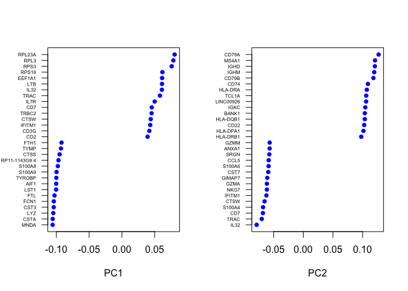
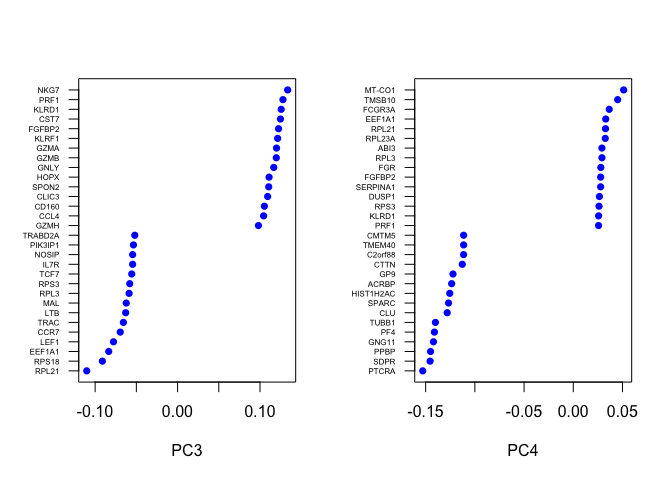
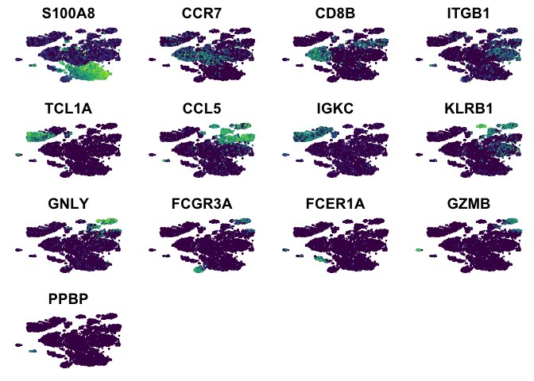

scRNA-Seq Tutorial Part 2: Exploration and Downstream Analysis
================

# Dependencies

``` r
library(Seurat)
```

    ## Loading required package: ggplot2

    ## Loading required package: cowplot

    ## 
    ## Attaching package: 'cowplot'

    ## The following object is masked from 'package:ggplot2':
    ## 
    ##     ggsave

    ## Loading required package: Matrix

``` r
library(dplyr)
```

    ## 
    ## Attaching package: 'dplyr'

    ## The following objects are masked from 'package:stats':
    ## 
    ##     filter, lag

    ## The following objects are masked from 'package:base':
    ## 
    ##     intersect, setdiff, setequal, union

``` r
library(viridis)
```

    ## Loading required package: viridisLite

# Load processed data

``` r
pbmc <- readRDS("../data/pbmc_processed.rds")
```

# Exploring the structure of the data

Rather than blindly diving into analyzing the data, it’s always a good
idea to explore it a bit. We’ll use a couple dimensionality reduction
techniques to visualize our data and get a rough idea of what’s going
on.

Typically, I would do a couple visualizations before clustering, but now
that we’re confident with our QC/filtering/normalization it’s safe to do
it now (and I know it will be helpful for some conversation in the next
section)

# Clustering

We cluster on PCA space, but need to know how many PCs capture a
reasonable amount of
variation

``` r
PCElbowPlot(object = pbmc, num.pc=50)
```

<!-- -->

``` r
pbmc <- FindClusters(object = pbmc, reduction.type = "pca", dims.use = 1:20, 
    resolution = 0.4, print.output = 0, save.SNN = TRUE, random.seed=2018)
```

Note that the resolution is a user-defined parameter and can be tweaked
if necessary. Higher resolution finds more clusters.

random.seed is just the seed of the random number generator. This allows
us all to get the same result

## PCA

We had already done this, but we’ll explore it a little deeper this
time.

``` r
PCAPlot(object = pbmc)
```

<!-- -->

Which genes drive a cells position along the first few PCs? Let’s look
at the genes with the highest loadings for the first few principal
components. We’ll also make it show up the top results for both positive
and negative
loadings.

``` r
VizPCA(object = pbmc, pcs.use = 1:2, do.balanced=T)
```

<!-- -->

``` r
VizPCA(object = pbmc, pcs.use = 3:4, do.balanced=T)
```

<!-- -->

If we take the genes with the top loadings and colour a PCA plot by
their expression, the relationship between PC loadings and expression
levels should become clear

``` r
#PC1 genes
FeaturePlot(pbmc, features.plot=c("RPL23A", "RPL3", "MNDA", "CSTA"), reduction.use="pca",
            cols.use=viridis(100))
```

<!-- -->

``` r
#PC2 genes
FeaturePlot(pbmc, features.plot=c("CD79A", "MS4A1", "IL32", "TRAC"), reduction.use="pca",
            cols.use=viridis(100))
```

<!-- -->

One problem with using PCA for complex data, however, is that it can
only capture a limited amount of variation that exists in the data. You
can start to see this in the first PCA plot of this section, where some
clusters on the left of the plot actually overlap quite a bit (which
would mean they’re crappy clusters if PCA was showing you everything).
Part of this is because PCA is a linear dimensionality technique, and
only so much variation can be captured by linear projections of the
data. This is apparent from the PC elbow plot above.

We’ve only been visualizing PC1 and 2, which will always capture the
most variation in the data, but you can see that PCs 3 and 4 also
capture a large amount of variation, and even PCs 5-7 have more than the
plateau that follows, suggesting there may be biological signal in there
as well. We’ve been ignoring these components in our exploration because
we haven’t been able to visualize them, but they likely contain
information that we’re interested in.

We can make more plots, visualizing these components if we want:

``` r
#PC3 genes from above
FeaturePlot(pbmc, features.plot=c("NKG7", "PRF1", "RPL21", "RPS18"), dim.1=3, dim.2=4,
            reduction.use="pca", cols.use=viridis(100))
```

<!-- -->

``` r
#PC4 genes from above
FeaturePlot(pbmc, features.plot=c("TMSB10", "FCGR3A", "PTCRA", "SDPR"), dim.1=3, dim.2=4,
            reduction.use="pca", cols.use=viridis(100))
```

<!-- -->

Wow, that’s interesting. It looks like PC3 is driven by a handful of
cells that are quite different from the rest of the population. When you
first see something like this, I strongly encourage you to not get super
excited and run to your PI about this cool, rare population of cells in
your data. It is possible that this is the case, but I would immediately
take a look at technical artifacts/variables that could drive
this.

``` r
FeaturePlot(pbmc, features.plot=c("nUMI", "nGene", "percent.mito"), dim.1=3, dim.2=4,
            reduction.use="pca", cols.use=viridis(100))
```

<!-- -->

``` r
PCAPlot(pbmc, dim.1=3, dim.2=4)
```

<!-- -->

It doesn’t seem to be associated with any technical variable that we’ve
measured, so perhaps it is something interesting. From here, we could
take a look at the genes with the lowest PC4 loadings and see if they
correspond with some specific immune cell type. We could also look to
see if there are associated with something like apoptosis/cell stress.
For now, we won’t get too worked about this and will continue with our
exploration and see if this population pops out in clustering

To deal with the issue of missing out on information in our 2D plots, we
can take advtange of non-linear dimensionality reduction techniques.
Ultimately, any technique that tries to project complex relationships
into 2-3 dimensions will lose information in the process, but these
methods tend to improve quite a bit from PCA, often at the cost of
interpretability of the cells’ positions on the plot.

## tSNE

tSNE is slow and it’s often unreasonably to run it on the entire data
set. To get around this, we first perform PCA, find how many PCs provide
a significant amount of information (based on the elbow plot from
above), and use the matrix of PC positions for each cell across those
components. ie. we run tSNE on a matrix containing ~30 values (PC
coordinates) for each of the 8k cells, rather than the thousands of gene
expression
values.

``` r
pbmc <- RunTSNE(object = pbmc, dims.use = 1:20, do.fast = TRUE)
```

``` r
TSNEPlot(pbmc)
```

<!-- -->

## Force-directed graphs

We won’t execute this code because the igraph.to.gexf function can take
a long time and it always seems to crash R right after it finishes. This
said, I figured I should talk about graph layouts.

This code construct a shared nearest neighbour graph between all cells
in PCA space (using 20 PCs) and then we convert it to a gexf file that
can be loaded into the program Gephi, which can be used to visualize
networks.

``` r
#library(rgexf)
#pbmc@meta.data$Cluster <- pbmc@ident
#pbmc_knn <- scran::buildSNNGraph(t(pbmc@dr$pca@cell.embeddings[,1:20]), k=10, d=NA)
#gexf <- igraph.to.gexf(pbmc_knn)
#write.gexf(nodes = gexf$nodes, 
           #edges = gexf$edges[,c(2,3)], 
           #nodesAtt = pbmc@meta.data, 
           #output = "../data/pbmc_graph.gexf")
```

After importing the gexf file into Gephi and applying the Forceatlas2
layout algorithm to it, we get our data looks like this: \[PBMC Graph\]
(<https://github.com/dpcook/scrna_seq_workshop_2018/blob/master/figs/pbmc_forceatlas2.png>)

# Identifying markers

With scRNA-Seq, we’re often trying to find marker genes that define each
of our populations/clusters.

Two approaches: 1) genes with high fold change vs. all other
populations, or 2) genes with high classification power (ie. if we find
a cell that expresses a marker, there’s a good chance that it’s a given
cell type)

We can do this a cluster at a time with the FindMarkers function, or we
can find markers for all clusters in one run using FindAllMarkers. This
function offers 9 different tests that can be used. The current default
is the Wilcoxon rank sum test. A recent paper benchmarked a large amount
of differential expression tests, which you can check out
[here](LINK%20PAPER). Wilcoxon test ranked quite highly in their list.

The only.pos option, when TRUE, will only return positive markers of
each cluster. Min.pct sets what percentage of cells the gene must be
detected in. Thresh.use is a log2 fold-change requirement to be
considered a marker.

``` r
#This will take 10-15 mins
pbmc.markers <- FindAllMarkers(object = pbmc, only.pos = TRUE, min.pct = 0.25, 
    thresh.use = 0.25, print.bar=T, random.seed=2018)
```

``` r
#How many markers per cluster
table(pbmc.markers$cluster)
```

    ## 
    ##   0   1   2   3   4   5   6   7   8   9  10  11 
    ## 558 113 123 100 176 200 173 185 597 639 483 590

Let’s just make a smaller data frame with the top markers (by logFC) of
each
group.

``` r
top_markers <- pbmc.markers %>% group_by(cluster) %>% top_n(1, avg_logFC)
```

If you look at the fold changes for all the markers, you’ll see that we
found some pretty strong markers for most populations. Cluster 1 and 3
don’t seem to have genes that are a *lot* higher, but it’s still pretty
good.

Let’s visualize the top marker expression across the cells

``` r
FeaturePlot(object = pbmc, features.plot = top_markers$gene, 
            cols.use = viridis(100), reduction.use = "tsne",
            no.axes=T, pt.size=0.5)
```

<!-- -->

Heatmaps are also a good way at looking at the stratification of
expression patterns across cells. Let’s make one, showing the top 10
markers of each cluster

``` r
top10 <- pbmc.markers %>% group_by(cluster) %>% top_n(10, avg_logFC)
# setting slim.col.label to TRUE will print just the cluster IDS instead of
# every cell name
DoHeatmap(object = pbmc, genes.use = top10$gene, slim.col.label = TRUE, remove.key = TRUE)
```

<!-- -->

# Pseudotime analysis

I want to see if I can fit this in here. Any trajectories exist in
PBMCs?

# Functional enrichment (GO Term and Pathway analysis)
