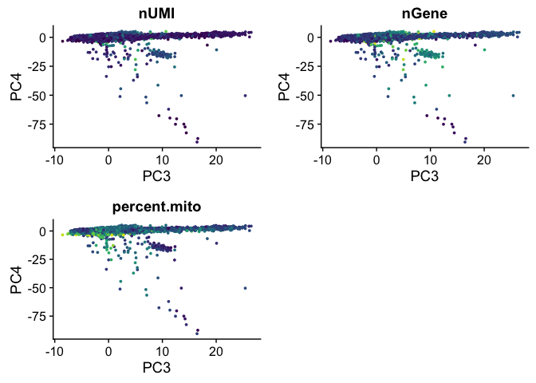
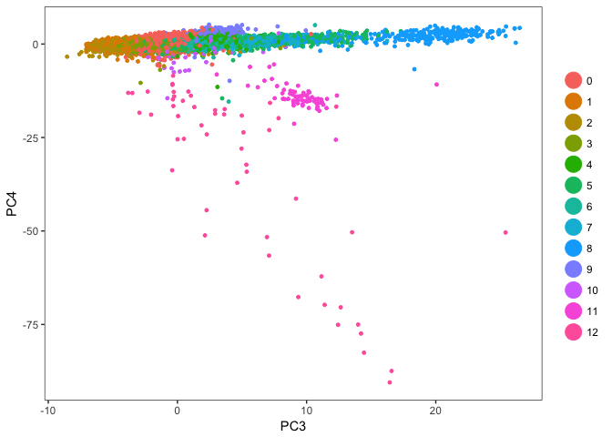

scRNA-Seq Tutorial Part 2: Exploration and Downstream Analysis
================

# Dependencies

``` r
library(Seurat)
```

    ## Loading required package: ggplot2

    ## Loading required package: cowplot

    ## 
    ## Attaching package: 'cowplot'

    ## The following object is masked from 'package:ggplot2':
    ## 
    ##     ggsave

    ## Loading required package: Matrix

``` r
library(viridis)
```

    ## Loading required package: viridisLite

# Load processed data

``` r
pbmc <- readRDS("../data/pbmc_processed.rds")
```

# Exploring the structure of the data

Rather than blindly diving into analyzing the data, it’s always a good
idea to explore it a bit. We’ll use a couple dimensionality reduction
techniques to visualize our data and get a rough idea of what’s going
on.

Typically, I would do a couple visualizations before clustering, but now
that we’re confident with our QC/filtering/normalization it’s safe to do
it now (and I know it will be helpful for some conversation in the next
section)

# Clustering

``` r
pbmc <- FindClusters(object = pbmc, reduction.type = "pca", dims.use = 1:20, 
    resolution = 0.6, print.output = 0, save.SNN = TRUE, random.seed=2018)
```

Note that the resolution is a user-defined parameter and can be tweaked
if necessary. 0.6-1.2 work well for a 3k cell dataset, but with more
cells, the resolution parameter should also be increased.

random.seed is just the seed of the random number generator. This allows
us all to get the same result

## PCA

We had already done this, but we’ll explore it a little deeper this
time.

``` r
PCAPlot(object = pbmc)
```

<!-- -->

Which genes drive a cells position along the first few PCs? Let’s look
at the genes with the highest loadings for the first few principal
components

``` r
VizPCA(object = pbmc, pcs.use = 1:2)
```

<!-- -->

``` r
VizPCA(object = pbmc, pcs.use = 3:4)
```

<!-- -->

If we take the genes with the top loadings and colour a PCA plot by
their expression, the relationship between PC loadings and expression
levels should become clear

``` r
#PC1 genes
FeaturePlot(pbmc, features.plot=c("RPS27A", "RPS3A", "CST3", "S100A9"), reduction.use="pca",
            cols.use=viridis(100))
```

<!-- -->

``` r
#PC2 genes
FeaturePlot(pbmc, features.plot=c("NKG7", "GZMB", "CD79A", "RPL18A"), reduction.use="pca",
            cols.use=viridis(100))
```

<!-- -->

One problem with using PCA for complex data, however, is that it can
only capture a limited amount of variation that exists in the data. You
can start to see this in the first PCA plot of this section, where some
clusters on the left of the plot actually overlap quite a bit (which
would mean they’re crappy clusters if PCA was showing you everything).
Part of this is because PCA is a linear dimensionality technique, and
only so much variation can be captured by linear projections of the
data. To demonstrate this, let’s look at standard deviation of the
PCs:

``` r
PCElbowPlot(object = pbmc)
```

<!-- -->

We’ve only been visualizing PC1 and 2, which will always capture the
most variation in the data, but you can see that PCs 3 and 4 also
capture a large amount of variation, and even PCs 5-7 have more than the
plateau that follows, suggesting there may be biological signal in there
as well. We’ve been ignoring these components in our exploration because
we haven’t been able to visualize them, but they likely contain
information that we’re interested in.

We can make more plots, visualizing these components if we want:

``` r
#PC3 genes from above
FeaturePlot(pbmc, features.plot=c("PF4", "PPBP", "LY6G6F", "SNCA"), dim.1=3, dim.2=4,
            reduction.use="pca", cols.use=viridis(100))
```

<!-- -->

``` r
#PC4 genes from above
FeaturePlot(pbmc, features.plot=c("CD37", "PKIG", "CD79A", "HLA-DQA1"), dim.1=3, dim.2=4,
            reduction.use="pca", cols.use=viridis(100))
```

<!-- -->

Wow, that’s interesting. It looks like PC3 is driven by a handful of
cells that are quite different from the rest of the population. When you
first see something like this, I strongly encourage you to not get super
excited and run to your PI about this cool, rare population of cells in
your data. It is possible that this is the case, but I would immediately
take a look at technical artifacts/variables that could drive
this.

``` r
FeaturePlot(pbmc, features.plot=c("nUMI", "nGene", "percent.mito"), dim.1=3, dim.2=4,
            reduction.use="pca", cols.use=viridis(100))
```

<!-- -->

``` r
PCAPlot(pbmc, dim.1=3, dim.2=4)
```

<!-- -->

It doesn’t seem to be associated with any technical variable that we’ve
measured, so perhaps it is something interesting. From here, we could
take a look at the genes with the highest PC3 loadings and see if they
correspond with some specific immune cell type. We could also look to
see if there are associated with something like apoptosis/cell stress.
For now, we won’t get too worked about this and will continue with our
exploration and see if this population pops out in clustering

To deal with the issue of missing out on information in our 2D plots, we
can take advtange of non-linear dimensionality reduction techniques.
Ultimately, any technique that tries to project complex relationships
into 2-3 dimensions will lose information in the process, but these
methods tend to improve quite a bit from PCA, often at the cost of
interpretability of the cells’ positions on the plot.

## tSNE

tSNE is slow and it’s often unreasonably to run it on the entire data
set. To get around this, we first perform PCA, find how many PCs provide
a significant amount of information (based on the elbow plot from
above), and use the matrix of PC positions for each cell across those
components. ie. we run tSNE on a matrix containing ~10 values (PC
coordinates) for each of the 3k cells, rather than the thousands of gene
expression
values.

``` r
pbmc <- RunTSNE(object = pbmc, dims.use = 1:10, do.fast = TRUE)
```

``` r
TSNEPlot(pbmc)
```

<!-- -->

## Diffusion Maps

``` r
pbmc <- RunDiffusion(pbmc, genes.use=pbmc@var.genes, q.use=0, 
                     dims.use=1:20, reduction.use="pca")
```

    ## Performing eigendecomposition
    ## Computing Diffusion Coordinates
    ## Elapsed time: 5.365 seconds

``` r
DMPlot(pbmc)
```

<!-- -->

## Force-directed graphs

# Identifying markers

Note that with complex populations, differential expression is a little
different than typical. If you just run a generic differential
expression test, it is likely that the majority of genes will be
differentially expressed because we would simply be looking for
variation anywhere across the population. A more useful direction in
this type of “cell type atlasing” experiment is to identify genes whose
expression uniquely defines a given population.

Traditional differential expression can be beneficial when making
comparisons across subsets of cell types, or between a given population
across two experimental conditions (eg. Wild-type vs. knockout)

# Pseudotime analysis

I want to see if I can fit this in here. Any trajectories exist in
PBMCs?

# Functional enrichment (GO Term and Pathway analysis)
